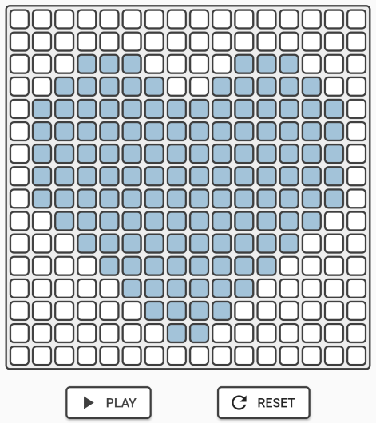

# flutternome

Music grid instrument inspired by the Tonematrix and the Monome grid.

# Videos

- [8x8 grid](https://streamable.com/uqe1y)
- [16x16 grid](https://streamable.com/9thqh)

# Links

- [Tonematrix:](https://tonematrix.audiotool.com/) Amazing flash app that allows you create beautiful melodies
- [Monome:](https://monome.org/docs/grid/) Minimalist DAW that can be programmed to work as a tonematrix